<h1 align="center">👋 Hey, i'm Sam Damazio</h1>

  🚢 Ex-oficial da Marinha  
  👨‍💻 Desenvolvedor Full Stack focado em soluções inteligentes com diversas tecnologias  
  📲 Criador do <b>Ceasinha</b>, app para feirantes e produtores rurais  
  🌎 EN / PT-BR

---

### 💼 Sobre mim

- 📝 Início da vida acadêmica - Aprovado em diversos concursos públicos no país
- 🎓 Formado pela Escola Naval (2022), com atuação como oficial maquinista na Marinha do Brasil
- 🚀 Fiz transição de carreira, focado em projetos com impacto real e soluções tecnológicas aplicadas
- 💻 Desenvolvedor com experiência prática em **Python**, **Django**, **Node.js**, **React**, **Firebase**, **React Native** e automação de processos
- 🧠 Entusiasta de inteligência artificial, dados e sistemas escaláveis

---

### 🧩 Tecnologias & Ferramentas

---

### 🌱 Projetos em destaque

## 🚀 Projetos em destaque

- 📦 [Ceasinha](https://www.ceasinha.app.br) - app de gestão para feirantes e produtores rurais (web e mobile por assinatura)  
  🔗 [Ceasinha-app](https://play.google.com/store/apps/details?id=com.iaforbusiness.ceasaapp&hl=en-US&ah=yG_UC3WlyTSFLEi2Rwn8Gs8LiSU) - GooglePlay
- 🎓 [Saber Livre](https://github.com/samdamazio/saber-livre) — plataforma open source para hospedar cursos gratuitos  
- 🤖 Automatizações com WhatsApp e bots inteligentes para agendamento de plantões médicos (privado)
- 📊 Scripts de scraping, análise de dados e geração de relatórios automatizados com Python (privado)

---

### 📫 Contato

- ✉️ Email: **sam.damazio@icloud.com**
- 🔗 LinkedIn: [linkedin.com/in/sam.damazio](www.linkedin.com/in/samuel-damazio-5a0976274)
- 📸 Instagram: [@sam.damazio](https://www.instagram.com/sam.damazio/)
- 📸 Instagram do Ceasinha: [@ceasinha.app](https://www.instagram.com/ceasinha.app/)
- 📁 Tabnews: [SamDamazio](https://www.tabnews.com.br/samdamazio/conteudos/1)

---

  Quer contar com o meu trabalho? 
Entre em contato para mais informações.

---

<h3 align="center">🧭 Ponte de comando</h3>

  <picture>
    <source media="(prefers-color-scheme: dark)" srcset="assets/sonar-dark.svg">
    
  </picture>
  <picture>
    <source media="(prefers-color-scheme: dark)" srcset="assets/maquinas-dark.svg">
    
  </picture>
  <picture>
    <source media="(prefers-color-scheme: dark)" srcset="assets/diario-dark.svg">
    
  </picture>
  <picture>
    <source media="(prefers-color-scheme: dark)" srcset="assets/sinais-dark.svg">
    
  </picture>

